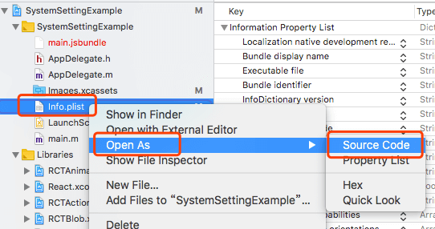

# App Store

## Bluetooth

Here are some bluetooth-function:

* `isBluetoothEnabled()`
* `addBluetoothListener()`

Your app may be rejected by App Store because of bluetooth, even if you never call these functions, see [this issues](https://github.com/c19354837/react-native-system-setting/issues/55).

If you need these function, you should add `NSBluetoothPeripheralUsageDescription` in your `Info.plist` as Apple's rule, see [I need bluetooth](#i-need-bluetooth)

Or, you can remove these code by **Preprocessor Macros**, see [I don't need bluetooth](#i-dont-need-bluetooth)

> Be sure that you have run `react-native link`, then open your iOS project by Xcode

### I need bluetooth

Open `Info.plist` as source code.


 
Then add `NSBluetoothPeripheralUsageDescription` in `Info.plist`, see [Info.plist - example](https://github.com/c19354837/react-native-system-setting/blob/master/examples/SystemSettingExample/ios/SystemSettingExample/Info.plist#L55-L56)

```xml
<?xml version="1.0" encoding="UTF-8"?>
<!DOCTYPE plist PUBLIC "-//Apple//DTD PLIST 1.0//EN" "http://www.apple.com/DTDs/PropertyList-1.0.dtd">
<plist version="1.0">
<dict>
  
  ...
  
  <key>NSBluetoothPeripheralUsageDescription</key>
  <string>Explain the reasons for accessing...</string>
  
</dict>
</plist>
```

> You can change the `string` as you need

### I don't need bluetooth

Delete preprocessor macros `BLUETOOTH`


> You should delete `BLUETOOTH` in both `Debug` and `Release`